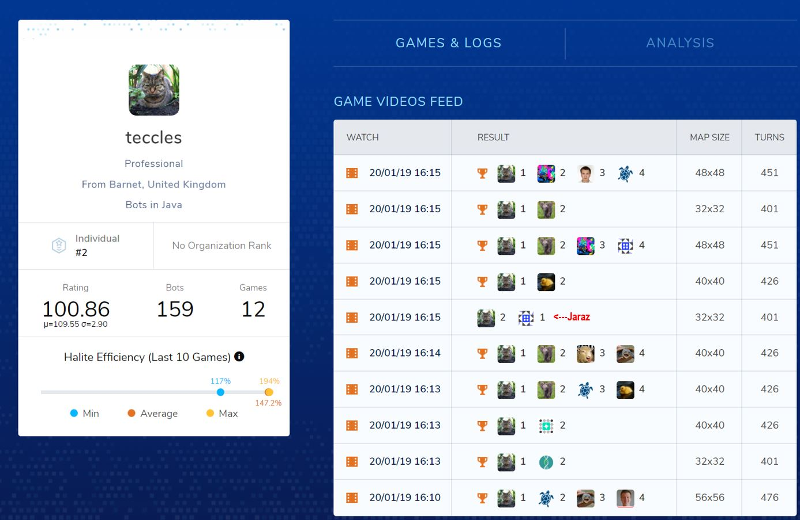

# Halite III
What started as a weekend to weeklong project became the most addicting thing I’ve done since my online poker days. The only reason I made it as far as a I did was numpy, scipy and a force of will. So in this I’ll try to go over a few functions that really helped me that I think can help others next year (hopefully!). 

If my code can teach you one thing, its that you should learn to code before trying a programming competition! But first a disclaimer, my code was not meant to be re-read, certainty not innocents who aren’t myself. To put my python experience into perspective I had to google what a dictionary was… I put this here since almost all the top 20 people have posted their code and maybe it can help someone. Skip to the bottom for my funny moments, which is the best part of this writeup imho.

## Bot basics
* Give macro orders – exploring, forced to mine, returning, build dropoff, attack, etc
* Find target squares – find best halite squares, move for better drop-offs, etc
* Execute movement – Use the beautiful linear_sum_assignments
* Ship build check – simple check

## What I learned
Conceptually this game was made a lot easier for me when I moved to numpy. A few matrix manipulations and you can tell you if your ship is inspired or if you have control of a section of the map. It also made debugging relatively easy, run a small map. Most of interesting stuff is just using linear-sum-assignments.

## Maximize halite per turn
My strategy was to just maximize halite per turn (hpt). Of course this easier said than done! For a while I just scanned around my ship but there had to be a better way. Going through all the numpy docs brought me to linear_sum_assignments and I love this little guy. Basically you build a matrix # ships x (width*height), each row has the ships estimates for HPT on a per square basis. Then it returns the best fit. 

##### First, hpt formulas:
For 2p,  
Hpt = halite * miningSpeed (25% or 75% if inspired) / distance + average halite / (distance + 1)  
Distance = distance to square + 1 + depoDistMarginal  
depoDistMarginal = (depoDistAll - depoDistAll[shipY][shipX]) * ship.halite_amount/1000  
depoDistAll – minimum distance between depo and each square  
Average halite is based on neighboring squares, discounted, with the most weight being the direct neighbors.

For 4p I use the same logic but calculated my hpt if I mined the square for 2,3 or 4 turns and took the max hpt. This yielded better in 2p, however it ended up inspiring enemies more than it helped me. I also added a term that encouraged my ships to take non-inspired halite b/c I was over fitted to inspired squares.

## Incoroprating drop-offs into hpt
I found drop-offs pretty hard to incorporate. You can’t just add the dropoff distance to my above hpt formula b/c you aren’t going back home until you fill up. So first I applied marginal changes to the distance formula, i.e. you leave a dropoff you should better get some good halite. But I also decayed this impact if the ship is empty. This is clearly an approximation but one that still seems pretty reasonable to me. Though I think I should have spent some more time on this part.

## Building dropoffs
I went through a few versions of the dropoff code. Effectively every turn I run a uniform filter from scipy and discard the below average squares, with the remaining being in a possible dropoff zone. There is some minimum size taken into account as well. I was going to setup a diamond filter for this but just didn’t get around to it. 
* ndimage.uniform_filter(targetMap, size = 8, mode = 'wrap')  

Each ship checks if its in a dropoff zone, and if so it hunts for the highest halite, conditioned on friendly ships, distance to other drop-offs, etc. Once enough money is halite is saved up to build it, it constructs where it is. 

## Ship building
For my journey to top 100 I just built more ships when I was down in score and stopped if I was up. For 4p I used average enemy score, this is pretty terrible though. Later I did something pretty simple, I just looked at the moving average of halite mined on the map (w/out inspiration or recovered halite from downed enemies). And I extrapolated that out till the end of the game and checked if you could mine enough to justify a ship. I put a few constraints on this but generally I think it did pretty well.

## Parameter tuning
So I see a lot of CLOPs and fancy words and phrases in a lot of other post-mortems, this is new to me so I did not use (or know) any of this. I tried to come up with some rough functions that would help but basically I manually tuned the remaining. So nothing too exciting here.

## Things that didn’t work
For 2p, it wasn’t hard to come up with improving my halite collection but this would frequently help my opponent more because of inspiration. I attempted to penalize my bot by taking this into account but I couldn’t get it to consistently beat my v76 submission. I suspect a cleaner code base would have helped

## Big Thanks
First thanks to Two Sigma, this competition was run flawlessly and I’m really impressed. Second, thanks to all the competitors, it was a real honor to compete with everyone! Finally, and perhaps biggest thanks of all, is to Mlomb and Forhstiwhrl, who made some amazing tools for this game. Mlomb’s website absolutely saved me multiple times when I had some big bugs in certain map sizes. 

## Funny moments (roughly in the order I experienced them):
* Wait I can swap my ships without crashing!? How the hell…
* Oh now you’re telling me inspiration creates halite…
* Yes my new build is awesome! FML it timeouts on 48x48 and above… like on turn 10
* The moment your top 50 bot loses to a ~200 because he camped your spawn (that might not be as relatable)
* Ok 4p is freaking annoying I’m just going to avoid all neighboring enemy squares… wait that works pretty well!
* That moment you realize you don’t have to mine a 9 halite square!
* Oh Teccles’ new version lost to my bot, I guess he had a bug. Poor guy but he’ll be fine… lets see how bad he's doing...

* Competition ends. Ok, how do these convolutions work because no way people are using np.einsum… holy hell that is easy…
* Sorry to all the people below #16 (especially Kovi, who was a beast in this competition) as you may be depressed after seeing this code!
